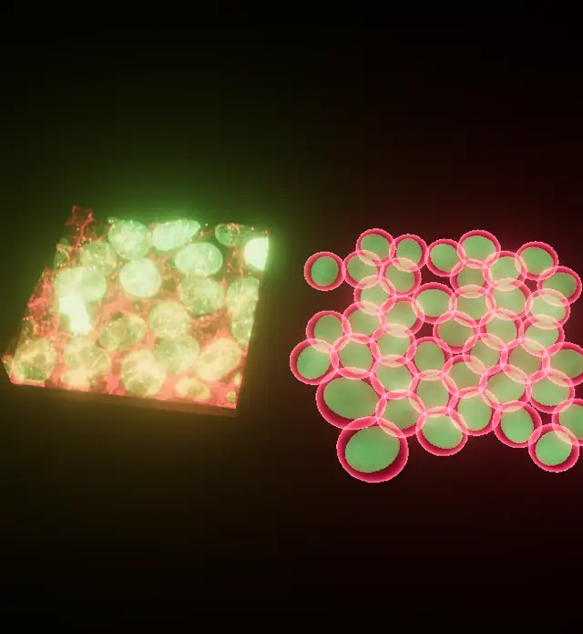
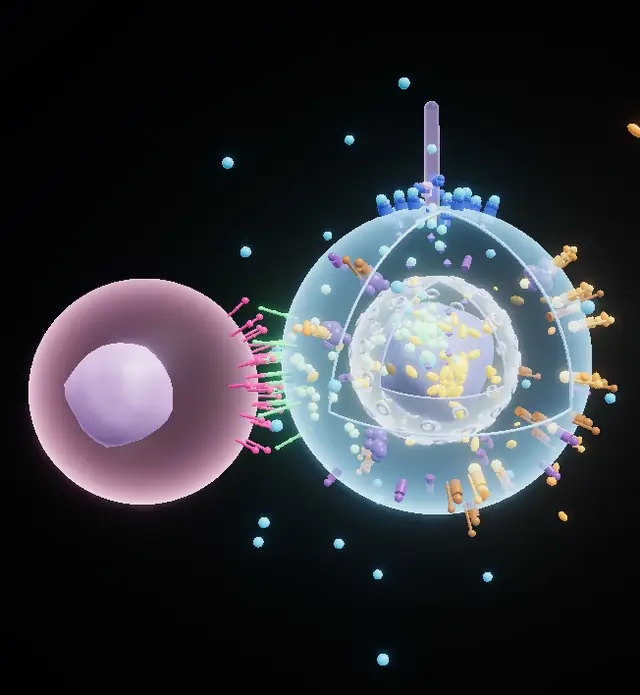
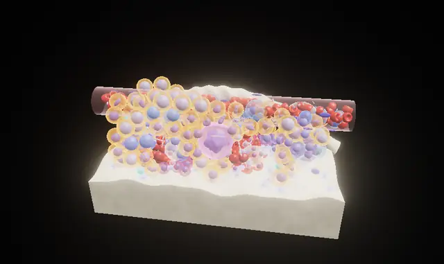
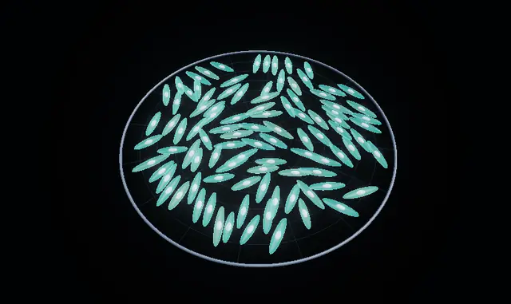
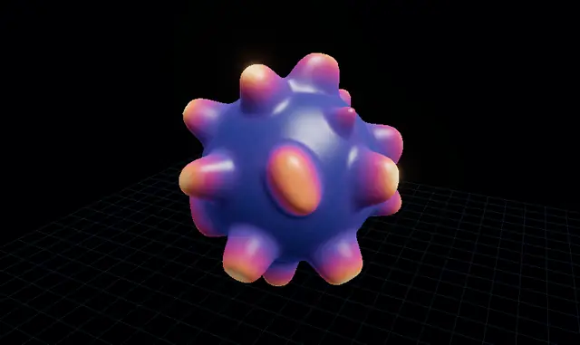
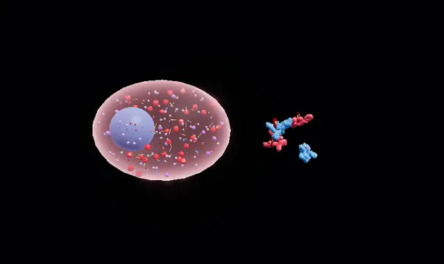
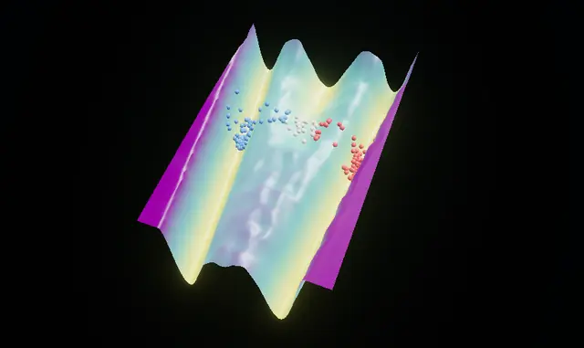
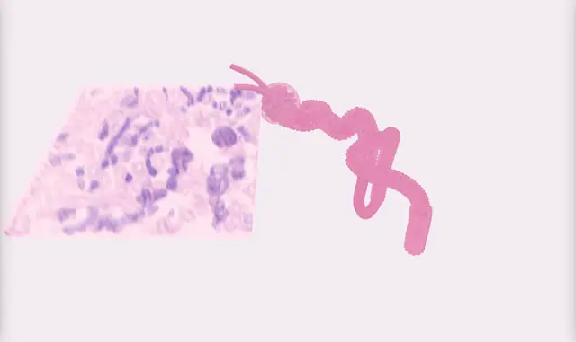

# Stem Cell Simulator

**Interactive 3D simulator of stem-cell differentiation and morphogenesis**, built
from the multi-order pathway framework of *Modeling Multi-Order Chemical Reactions
and Integrated Cellular Pathways* (2024) and **calibrated on real microscopy**.

It follows the paper from **first-order** stem-cell signalling (Notch, Wnt, Hedgehog)
through **second-order** progenitor commitment (MAPK/ERK, JAK/STAT, hematopoiesis)
and **third-order** differentiated cells (myogenesis, neurogenesis, hormonal feedback)
to **fourth-order** morphogenesis (crosstalk, morphogen gradients, Turing patterns,
adhesion, ECM). It also covers the paper's protein construction (hemoglobin,
collagen), epigenetics and cellular map. Every process is a real 3D model:

- 3D cell mechanics with division
- ODE and stochastic pathway kinetics
- reaction–diffusion on meshes
- growing neurites
- fusing myotubes
- assembling molecules

It runs in the browser with three.js.

<p align="center">
  
  
</p>

## Run it

```bash
npm run serve        # any static server works; WebGL 2 required
# open http://localhost:8080
```

No build step and no network access are needed. three.js is vendored.
Deep links open a specific view, e.g. `#signaling?view=spheroid`,
`#proteins?view=collagen`, `#gallery?view=rbc`.

**Controls:**

- Orbit, pan and zoom with the mouse.
- `space` pauses; `r` resets.
- `1` / `2` / `3` switch render mode.
- **section** cuts the scene with a plane, like a microscope's optical section.

## The scenes

| Scene | What you see | Paper |
|---|---|---|
| **Stem-cell colony · digital twin** | A real 3D confocal stack of cells (Allen Institute, CC0), ray-marched. Its 22 cells and nuclei are segmented and meshed in 3D, then continued forward as a growing, dividing 3D colony. The anaphase cell caught in the stack finishes its division. | Stage 1, self-renewal HSC → HSC + HSC |
| **Kidney · organ-level volume** | A real 3D kidney confocal volume beside a to-scale 3D nephron: glomerulus with podocytes and mesangial cells, the tubule segments, and filtrate reabsorption. | Organs → kidney |
| **Stage 1 · Notch, Wnt & Hedgehog** | A cut-away stem cell with receptors, ligands, the destruction complex, cleavage, a cilium and nuclear import, with every particle count driven by the pathway ODEs. Also a 300-cell spheroid with lateral inhibition and Wnt/Shh gradients. | First order |
| **Stage 2 · Progenitor commitment** | A 3D bone-marrow niche. HSCs self-renew and commit through the GATA1–PU.1 toggle. Erythroblasts hemoglobinise and enucleate into biconcave red cells; megakaryocytes shed platelets. MAPK and JAK/STAT drive the process. | Second order, hematopoietic example |
| **Stage 3 · Muscle, neurons & feedback** | Myoblasts align and fuse into striated myotubes. Neurons grow axons guided by a chemotactic field and form synapses. A Goodwin hormonal loop crosses its Hopf threshold. | Third order |
| **Stage 4 · Morphogenesis** | Turing patterns budding an organoid surface, morphogen French flags, differential-adhesion sorting, and ECM with chemotaxis + haptotaxis. | Fourth order, Turing section |
| **Protein foundry** | Hemoglobin (α/β globins → dimer → tetramer → 4 heme → O₂) and collagen (hydroxylation → triple helix → cleavage → D-banded fibril). Knobs for β-thalassaemia, AHSP, HRI, scurvy and dermatosparaxis. | Constructing complex proteins |
| **Epigenetic landscape** | A Waddington surface computed as U = −ln P of a fate circuit, with the paper's DNMT/HAT/HDAC reactions and a reprogramming reset. | Epigenetic modifications |
| **Reaction network** | Every modelled reaction, grouped by order and laid out in 3D by PCA of the adjacency matrix, with crosstalk hubs highlighted. | Methodology (graphs, PCA), orders 1–4 |
| **Cellular map** | 164 cell types in 17 lineages, the cells → tissues → organs → systems hierarchy, and the organ-system interactions. | Cellular map, higher-level interactions |
| **Micrograph gallery** | Each real reference image with an **animated variation** made from its own pixels, next to a 3D model of the same process. | Validation |

<p align="center">
  
  
  
</p>
<p align="center">
  
  
  
</p>

### Three ways to look at every scene

- **3D:** physical rendering. Membranes are translucent and nuclei are textured.
- **Confocal:** fluorescence emission, the way a laser-scanning confocal images dyed cells.
- **H&E:** virtual hematoxylin & eosin histology via Beer–Lambert absorption (Giacomelli et al. 2016 coefficients). The real confocal volumes are converted the same way, so the simulated and the real tissue can be compared as if they were slides.

## Real microscopy, not stock art

The reference images are openly licensed (CC0, public domain or MIT) and pinned by
SHA-256 in [`assets/micrographs/catalog.json`](assets/micrographs/catalog.json).
They are downloaded and processed reproducibly by
[`tools/build_assets.py`](tools/build_assets.py), and the measurements feed the models:

| Measured on real data | Value | Used by |
|---|---|---|
| Nucleus / cell volume (3D segmentation) | 756 / 3,188 µm³ | colony twin geometry |
| Monolayer height · nucleus spacing | 11.6 µm · 13.0 µm | twin mechanics |
| Mitotic index (306 nuclei) | 0.062 → cell cycle ≈ 16 h | division clock |
| Nuclear-envelope targeting (live movie) | τ = 13.5 frames, R² = 0.955 | nuclear-import step |
| Red-cell absorbance profile vs 3D Evans–Fung model | r = 0.98 | validates the 3D erythrocyte |
| Lymphocyte nucleus (RBC as ruler) | 9.2 µm | lymphocyte agents |
| Intestinal organoids | 91, radius CV 0.33 | organoid scenes |

A further 46 openly licensed reference micrographs are catalogued per process in
[`assets/micrographs/references.json`](assets/micrographs/references.json).

## Models

Everything under [`js/models/`](js/models) is plain, tested JavaScript. It covers the
paper's equations (the Wnt cascade and the Neurogenin ODEs are implemented verbatim,
with analytic solutions in the tests), plus established models that make each step
computable:

- Collier lateral inhibition
- Huang–Ferrell MAPK
- the GATA1–PU.1 toggle
- Goodwin oscillators
- Schnakenberg/Gray–Scott Turing kinetics
- Anderson–Chaplain chemotaxis + haptotaxis
- Wang's U = −ln P landscape
- mass-action hemoglobin and collagen assembly

See [`docs/MODELS.md`](docs/MODELS.md) for equations and citations, and
[`docs/PAPER_MAPPING.md`](docs/PAPER_MAPPING.md) for where each section of the
paper is implemented.

## Reproduce and test

```bash
# models (Node >= 20)
node --test tests/models/*.test.mjs

# data pipeline (Python 3.11)
pip install -r tools/requirements.txt
python tools/fetch_micrographs.py     # downloads + verifies SHA-256
python tools/build_assets.py          # regenerates assets/derived (bit-identical)
python -m pytest -q tests/tools

# every scene and view in headless Chromium, all three render modes
npm ci && npx playwright install chromium
node tests/e2e/smoke.mjs --all --modes

# animated previews for this README
node tools/capture_previews.mjs
```

CI runs all of the above on every pull request. A GitHub Pages workflow publishes
the simulator from `main`; enable **Settings → Pages → Source: GitHub Actions** once.

## Layout

```
index.html, css/, js/main.js   app shell
js/engine/                     rendering, materials (3D / confocal / H&E), volumes, UI, charts
js/models/                     simulation code (pathways, mechanics, morphogenesis, proteins, atlas, network)
js/scenes/                     one module per 3D scene
assets/micrographs/            catalogue of reference data (+ references.json)
assets/derived/                committed outputs of the pipeline
tools/                         fetch, build and preview tooling
tests/                         node:test, pytest, headless-browser smoke tests
docs/                          architecture, models, paper mapping, images
```

See [`docs/ARCHITECTURE.md`](docs/ARCHITECTURE.md) to add a scene.

## Scope

This is an interactive research and teaching simulator, not a predictive
clinical model. Pathway kinetics are dimensionless unless units are stated, and
many rate constants are qualitative choices. Each model's `about` text and
`docs/MODELS.md` separate established models from phenomenological
simplifications. The paper reports reaction counts of ~500 / 1,051 / 2,051 /
3,021 for orders 1–4. The network scene shows those figures next to the number
of reactions this code actually models, without conflating the two.

## Licence

Code: MIT ([`LICENSE`](LICENSE)). Data and third-party components keep their own
licences ([`ATTRIBUTION.md`](ATTRIBUTION.md)).
